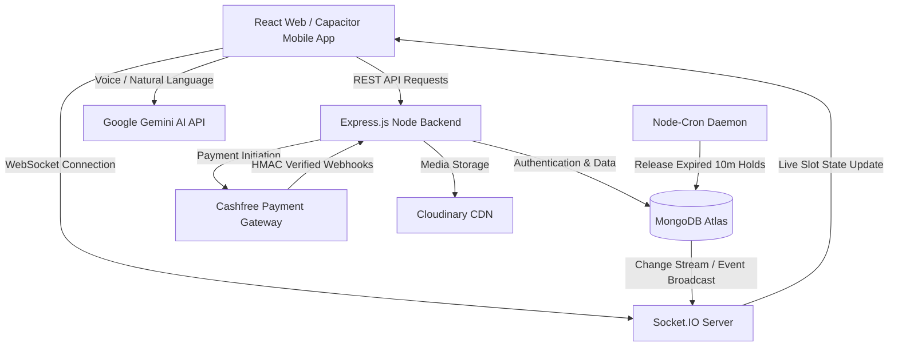
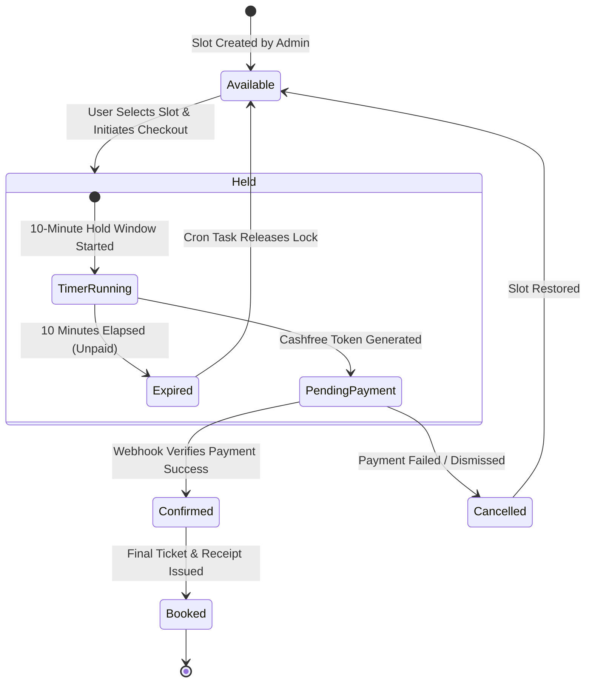

# 🏏 BookMyBox — Real-Time Box Cricket Booking Platform

[](https://www.bookmybox.online)
[](https://github.com/Alfaz-17/box-Cricket)
[](https://www.typescriptlang.org)
[](https://react.dev)
[](https://nodejs.org)
[](https://expressjs.com)
[](https://www.mongodb.com)
[](https://socket.io)
[](https://ai.google.dev)
[](https://www.cashfree.com)
[](https://www.docker.com)
[](https://vitest.dev)

> **BookMyBox** is an end-to-end, high-concurrency B2C sports turf reservation platform designed for box cricket venue owners and sports enthusiasts. Built with a modern **TypeScript MERN** architecture, it features real-time WebSocket slot synchronization, a natural language **Google Gemini AI** booking assistant, automated **Cashfree** payment reconciliation with HMAC security, and native cross-platform mobile app support via **CapacitorJS**.

---

## 📖 Table of Contents

- [🌟 System Highlights & Key Features](#-system-highlights--key-features)
- [🏗️ System Architecture & Data Flow](#️-system-architecture--data-flow)
- [🔄 Slot Booking & Payment Concurrency Lifecycle](#-slot-booking--payment-concurrency-lifecycle)
- [🛠️ Tech Stack](#️-tech-stack)
- [📂 Codebase Structure](#-codebase-structure)
- [📊 Database Schema Design](#-database-schema-design)
- [📡 API Reference](#-api-reference)
- [⚙️ Environment Variables](#️-environment-variables)
- [💻 Getting Started & Local Setup](#-getting-started--local-setup)
- [🧪 Testing & Quality Assurance](#-testing--quality-assurance)
- [🚢 Deployment & CI/CD](#-deployment--cicd)
- [📞 Contact & Business Inquiries](#-contact--business-inquiries)

---

## 🌟 System Highlights & Key Features

### 1. 🤖 AI-Powered Booking Assistant (Google Gemini AI)
* **Natural Language Processing**: Translates voice or text queries (e.g. *"Book pitch 1 for 2 hours this Friday starting at 7 PM"*) into structured parameters (`date`, `startTime`, `duration`, `boxId`).
* **Automated Slot Allocation**: Seamlessly passes parsed parameters to the slot engine, allowing hands-free checkout.

### 2. ⚡ Real-Time Concurrency Slot Engine (Socket.IO)
* **Live Availability Grid**: Slot status updates (`Available`, `Held`, `Booked`) are pushed instantaneously to all active users via WebSockets.
* **Race Condition Protection**: Atomic MongoDB transaction checks lock slots upon payment initiation to prevent double-booking collisions.

### 3. 💳 Cashfree Payment Pipeline & Auto-Reconciliation
* **Cryptographic HMAC Security**: Validates Cashfree webhook payloads using SHA-256 signatures before confirming slot allocation.
* **Automated Hold Expiration**: A background `node-cron` daemon continuously cleans up unconfirmed reservations after a 10-minute hold window.

### 4. 📱 Cross-Platform Web & Mobile App (PWA + Capacitor)
* **Progressive Web App**: Fast loading, offline fallback, and installable PWA manifest.
* **Native Android APK**: Built with CapacitorJS for native mobile app distribution.

### 5. 🛡️ Enterprise Security & Access Control
* **Authentication**: Secure Phone Number OTP login and Google OAuth with JWT session tokens.
* **Role-Based Controls (RBAC)**: Distinct permissions for regular players vs. venue owners.
* **API Hardening**: Express Rate Limiting, Helmet HTTP security headers, CORS guards, and Mongo Sanitize defense against injection attacks.

### 6. 📊 Turf Owner Management Suite
* **Box Administration**: Add/edit box details, set hourly tariffs, upload media to Cloudinary.
* **Slot Control**: One-click manual slot locking for offline bookings or maintenance.
* **Business Analytics**: Track booking history, peak revenue hours, and customer retention metrics.

---

## 🏗️ System Architecture & Data Flow



---

## 🔄 Slot Booking & Payment Concurrency Lifecycle



---

## 🛠️ Tech Stack

| Layer | Technologies & Tools |
| :--- | :--- |
| **Frontend Web Client** | React 18, TypeScript, Vite, Tailwind CSS, Lucide Icons, Axios, React Router v6 |
| **Mobile App Runtime** | CapacitorJS, Android SDK, Gradle |
| **Backend API Engine** | Node.js, Express.js, TypeScript, Socket.IO, Winston, Morgan, Zod |
| **Database & Caching** | MongoDB Atlas, Mongoose ODM, Upstash Redis |
| **Artificial Intelligence** | Google Gemini GenAI SDK (`@google/genai`) |
| **Payments & CDN** | Cashfree Gateway API, Cloudinary Asset Engine |
| **DevOps & Testing** | Docker, Docker Compose, Vitest, GitHub Actions, NGINX, Vercel, Render |

---

## 📂 Codebase Structure

```bash
box-cricket/
├── backend/
│   ├── src/
│   │   ├── controllers/   # API logic (auth, boxes, slots, bookings, payments, AI)
│   │   ├── cron/          # Scheduled background tasks (expired hold releasing engine)
│   │   ├── lib/           # Database connections & Socket.IO initialization
│   │   ├── middleware/    # Auth guards, rate limiters, validation, error handlers
│   │   ├── models/        # Mongoose ODM schemas (User, Box, Booking, Review)
│   │   ├── routes/        # Express REST endpoints
│   │   ├── utils/         # HMAC signatures, datetime helper functions
│   │   ├── validators/    # Zod payload validation schemas
│   │   └── server.ts      # Server bootstrap & WebSocket server setup
│   ├── tests/             # Vitest unit & integration test suites
│   ├── .env.example       # Backend environment configuration template
│   ├── Dockerfile         # Node.js backend container configuration
│   └── package.json
├── frontend/
│   ├── public/            # Icons, sitemap.xml, robots.txt, static assets
│   ├── src/
│   │   ├── components/    # Reusable UI components (AI Bar, Slot Grid, Navbars)
│   │   ├── context/       # AuthContext & SocketContext providers
│   │   ├── pages/         # Application view pages (Home, BoxDetails, Admin, History)
│   │   ├── services/      # Axios HTTP client wrappers
│   │   └── utils/         # Helper functions & date formatters
│   ├── .env.example       # Frontend environment configuration template
│   ├── Dockerfile         # Production NGINX client build container
│   ├── nginx.conf         # Single-Page Application NGINX routing
│   └── package.json
├── bookmybox-app/         # Capacitor Android mobile application project
├── tasks/                 # Project documentation & SEO implementation plans
├── docker-compose.yml     # Multi-container local deployment orchestrator
├── .gitignore             # Global git exclusion rules
└── README.md              # Master project documentation
```

---

## 📊 Database Schema Design

### 1. User Schema (`User.ts`)
```typescript
{
  name: { type: String, required: true },
  phone: { type: String, required: true, unique: true },
  email: { type: String, unique: true, sparse: true },
  role: { type: String, enum: ['user', 'admin'], default: 'user' },
  createdAt: { type: Date, default: Date.now }
}
```

### 2. Box / Turf Schema (`Box.ts`)
```typescript
{
  title: { type: String, required: true },
  location: { type: String, required: true },
  description: { type: String },
  pricePerHour: { type: Number, required: true },
  images: [{ type: String }],
  amenities: [{ type: String }],
  isActive: { type: Boolean, default: true }
}
```

### 3. Booking Schema (`Booking.ts`)
```typescript
{
  user: { type: Schema.Types.ObjectId, ref: 'User', required: true },
  box: { type: Schema.Types.ObjectId, ref: 'Box', required: true },
  date: { type: String, required: true }, // Format: YYYY-MM-DD
  selectedSlots: [{ type: String, required: true }], // e.g. ["06:00 PM - 07:00 PM"]
  totalAmount: { type: Number, required: true },
  status: { type: String, enum: ['Pending', 'Confirmed', 'Cancelled'], default: 'Pending' },
  paymentId: { type: String },
  orderId: { type: String, required: true, unique: true },
  expiresAt: { type: Date } // 10-minute hold expiry timestamp
}
```

---

## 📡 API Reference

### 🔐 Authentication Routes (`/api/auth`)
| Method | Endpoint | Access | Description |
| :--- | :--- | :--- | :--- |
| `POST` | `/api/auth/send-otp` | Public | Sends OTP to user's mobile number |
| `POST` | `/api/auth/verify-otp` | Public | Verifies OTP and returns JWT token |
| `GET` | `/api/auth/me` | User / Admin | Retrieves current authenticated profile |

### 🏏 Turf Box Routes (`/api/boxes`)
| Method | Endpoint | Access | Description |
| :--- | :--- | :--- | :--- |
| `GET` | `/api/boxes` | Public | Lists all active box cricket turfs |
| `GET` | `/api/boxes/:id` | Public | Retrieves specific box details & amenities |
| `POST` | `/api/boxes` | Admin | Creates a new box turf profile |
| `PUT` | `/api/boxes/:id` | Admin | Updates existing turf details |
| `DELETE` | `/api/boxes/:id` | Admin | Soft-deletes / deactivates box profile |

### ⏰ Slot Management Routes (`/api/slots`)
| Method | Endpoint | Access | Description |
| :--- | :--- | :--- | :--- |
| `GET` | `/api/slots/:boxId?date=YYYY-MM-DD` | Public | Fetches real-time slot availability map |
| `POST` | `/api/slots/lock` | User | Temporarily holds selected slots (10m lock) |
| `POST` | `/api/slots/toggle-block` | Admin | Manually blocks/unblocks slots for maintenance |

### 💳 Booking & Payment Routes (`/api/booking`, `/api/payment`)
| Method | Endpoint | Access | Description |
| :--- | :--- | :--- | :--- |
| `POST` | `/api/payment/create-order` | User | Initiates Cashfree order & generates session ID |
| `POST` | `/api/payment/verify` | User | Manually verifies payment status post-checkout |
| `POST` | `/api/payment/webhook` | Public (Signed) | Receives Cashfree webhook callback (HMAC validated) |
| `GET` | `/api/booking/my-bookings` | User | Fetches user's booking history & receipts |

### 🤖 AI & Analytics Routes (`/api/ai`, `/api/analytics`)
| Method | Endpoint | Access | Description |
| :--- | :--- | :--- | :--- |
| `POST` | `/api/ai/parse-booking` | Public | Parses voice/text prompt via Gemini into slot parameters |
| `GET` | `/api/analytics/dashboard` | Admin | Fetches revenue metrics, booking counts, & statistics |

---

## ⚙️ Environment Variables

### Backend Configuration (`/backend/.env`)
```env
PORT=5001
NODE_ENV=development
CLIENT_URL=http://localhost:5173
BACKEND_URL=http://localhost:5001

MONGO_URI=mongodb+srv://<username>:<password>@cluster.mongodb.net/boxbooking
REDIS_URI=rediss://default:<token>@<host>:<port>

JWT_SECRET=your_jwt_secret_here
OWNER_CODE=your_owner_passcode_here

CLOUDINARY_CLOUD_NAME=your_cloud_name
CLOUDINARY_API_KEY=your_api_key
CLOUDINARY_API_SECRET=your_api_secret

CASHFREE_CLIENT_ID=your_cashfree_client_id
CASHFREE_CLIENT_SECRET=your_cashfree_client_secret

GEMINI_API_KEY=your_google_gemini_api_key
```

### Frontend Configuration (`/frontend/.env.local`)
```env
VITE_API_BASE_URL=http://localhost:5001
```

---

## 💻 Getting Started & Local Setup

### Prerequisites
- **Node.js**: v18.0.0 or higher
- **MongoDB**: Local MongoDB instance or MongoDB Atlas cluster URL
- **Docker & Docker Compose**: (Optional, for containerized environment)

---

### Option A: Running with Docker Compose (Recommended)

1. Clone the repository:
   ```bash
   git clone https://github.com/Alfaz-17/box-Cricket.git
   cd box-Cricket
   ```

2. Spin up all containers:
   ```bash
   docker-compose up --build
   ```

3. Access the application:
   - **Frontend App**: `http://localhost:5173`
   - **Backend API**: `http://localhost:5001/api`

---

### Option B: Manual Local Setup

#### 1. Setup Backend API
```bash
# Navigate to backend directory
cd backend

# Install node dependencies
npm install

# Copy environment template & update values
cp .env.example .env

# Start TypeScript development server
npm run dev
```

#### 2. Setup Frontend Web Client
```bash
# Open a new terminal and navigate to frontend directory
cd frontend

# Install node dependencies
npm install

# Copy environment template & update values
cp .env.example .env.local

# Start Vite dev server
npm run dev
```

#### 3. Build Mobile Android APK (Optional)
```bash
# Navigate to mobile project directory
cd bookmybox-app

# Install dependencies & sync web build
npm install
npx cap sync android

# Open Android Studio to build APK
npx cap open android
```

---

## 🧪 Testing & Quality Assurance

Unit and integration tests are powered by **Vitest**, covering datetime slot partitioning, time zone calculations, and payment lock expirations.

```bash
# Run Vitest suite in backend
cd backend
npm run test
```

---

## 🚢 Deployment & CI/CD

- **Frontend Client**: Deployed on **Vercel** with automatic deployment triggers on `main` branch pushes.
- **Backend API**: Hosted on **Render** / **AWS EC2** with automated NGINX reverse proxy.
- **CI/CD Pipeline**: GitHub Actions (`.github/workflows/ci.yml`) runs TypeScript compilation checks, Vitest test suites, and Docker image validation on every Pull Request.

---

## 📞 Contact & Business Inquiries

- **Live Platform**: [www.bookmybox.online](https://www.bookmybox.online)
- **Business Hotline**: `+91 6353783332`
- **Repository**: [github.com/Alfaz-17/box-Cricket](https://github.com/Alfaz-17/box-Cricket)
