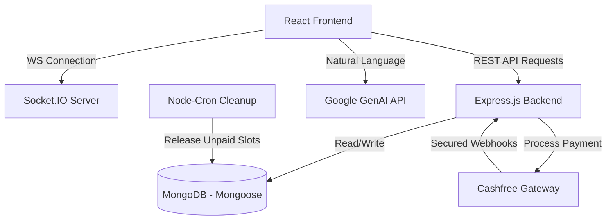

# 🏏 BookMyBox — Real-Time Box Cricket Booking Platform

[](https://www.bookmybox.online)
[](https://github.com/Alfaz-17/box-Cricket)
[](https://react.dev)
[](https://nodejs.org)
[](https://www.mongodb.com)
[](https://www.docker.com)

BookMyBox is a high-performance, real-time B2C sports turf booking application. Built using the **MERN** stack, it resolves concurrency challenges in booking systems via Socket.IO and leverages Google GenAI to offer a natural language interface for reserving turf times.

---

## 🌟 Architectural Features & Design Patterns

### 1. 🤖 AI Booking Assistant (Google GenAI)
* **Natural Language Parsing**: Integrates the **Gemini SDK** to interpret human input (e.g., *"Book a turf for 2 hours next Friday starting at 6 PM"*) and extract structured query parameters (`date`, `startTime`, `duration`, `boxId`).
* **Seamless Conversion**: Automatically maps structured output directly into the slot allocation engine, bypassing manual form input.

### 2. ⚡ Real-Time Slot Engine (Socket.IO WebSockets)
* **Instant Broadcasts**: Changes in slot availability are pushed in real time to all connected clients.
* **Race Condition Mitigation**: Implements transaction checks in MongoDB to lock slot states during payment initiation, preventing double-bookings.
* **Bi-directional Communication**: Maintains web sockets to update turf occupancy lists instantly.

### 3. 🔒 Secure Cashfree Payment Pipeline
* **Cryptographic Signatures**: Validates webhook payloads from the **Cashfree Gateway** using custom SHA256 HMAC signature verification.
* **Automated Reconciliation**: Tracks booking lifecycle (`Pending` -> `Paid` -> `Cancelled`). A background cleanup cron job releases unpaid, reserved slots after a 10-minute expiry window.

### 4. 🧪 Robust DevOps & Testing
* **Vitest Suite**: Unit tests cover complex datetime slot partitioning, time zone overlaps, and conflict resolution logic.
* **Dockerized Deployments**: Uses multi-stage builds and Docker Compose to link MongoDB, Node.js API, and the React client.
* **CI/CD Pipeline**: GitHub Actions automates test runs, builds Docker images, and manages Vercel/Render deployment targets.

---

## 🏗️ System Architecture



---

## 📂 Codebase Directory Structure

```bash
box-cricket/
├── backend/
│   ├── controllers/      # Route controllers (auth, booking, payment, box)
│   ├── cron/             # Scheduled scripts (expired slot cleanups)
│   ├── lib/              # Config files (MongoDB client, Socket.io initialization)
│   ├── models/           # Mongoose ODM schemas
│   ├── routes/           # Express router endpoints
│   ├── tests/            # Vitest unit & integration tests
│   └── server.js         # Express app bootstrap & socket server
├── frontend/
│   ├── public/           # Static assets
│   ├── src/
│   │   ├── components/   # Modular, reusable UI elements
│   │   ├── pages/        # Dashboard, turf listings, booking flow, landing pages
│   │   ├── context/      # Auth & Socket state providers
│   │   └── utils/        # Axios API wrapper, helpers
│   └── package.json
├── docker-compose.yml    # Multi-container orchestration
└── README.md
```

---

## 📊 Database Schema Design (Mongoose)

### **User Schema**
```javascript
{
  name: { type: String, required: true },
  phone: { type: String, required: true, unique: true },
  email: { type: String, unique: true },
  role: { type: String, enum: ['user', 'admin'], default: 'user' }
}
```

### **Box (Turf) Schema**
```javascript
{
  title: { type: String, required: true },
  location: { type: String, required: true },
  pricePerHour: { type: Number, required: true },
  images: [{ type: String }],
  slots: [{
    time: { type: String }, // e.g. "06:00 AM - 07:00 AM"
    isBooked: { type: Boolean, default: false }
  }]
}
```

### **Booking Schema**
```javascript
{
  user: { type: Schema.Types.ObjectId, ref: 'User', required: true },
  box: { type: Schema.Types.ObjectId, ref: 'Box', required: true },
  date: { type: Date, required: true },
  selectedSlots: [{ type: String }], // Array of time strings
  totalAmount: { type: Number, required: true },
  status: { type: String, enum: ['Pending', 'Confirmed', 'Cancelled'], default: 'Pending' },
  paymentId: { type: String }
}
```

---

## 📡 API Reference

### Auth Endpoints
* **`POST /api/auth/send-otp`**: Trigger phone-number based OTP login.
* **`POST /api/auth/verify-otp`**: Authenticate OTP and issue JWT.

### Box & Slot Endpoints
* **`GET /api/boxes`**: Fetch list of all active turfs.
* **`GET /api/boxes/:id/slots?date=YYYY-MM-DD`**: Fetch slot availability map for a specific date (real-time).
* **`POST /api/boxes` (Admin)**: Add a new box turf profile.

### Booking & Payment Endpoints
* **`POST /api/booking/reserve`**: Create temporary slot reservation (starts 10-minute hold).
* **`POST /api/payment/initiate`**: Generate Cashfree Order Token for client payment script.
* **`POST /api/payment/webhook`**: Receive transaction updates directly from Cashfree with cryptographic verification.

---

## ⚙️ Installation & Setup

### 1. Prerequisites
* Node.js (v18 or higher)
* MongoDB database (local instance or MongoDB Atlas)
* Cashfree credentials (Client ID and Secret)
* Gemini API Key

### 2. Backend Environment Variables
Create a `.env` file in the `/backend` directory:
```env
PORT=5001
MONGO_URI=mongodb+srv://<username>:<password>@cluster.mongodb.net/boxcricket
JWT_SECRET=your_jwt_secret_token
CLIENT_URL=http://localhost:5173

# Cashfree API Configuration
CASHFREE_CLIENT_ID=your_cashfree_client_id
CASHFREE_CLIENT_SECRET=your_cashfree_client_secret
CASHFREE_ENVIRONMENT=TEST # or PRODUCTION

# Gemini AI Configuration
GEMINI_API_KEY=your_google_gemini_api_key
```

### 3. Running Locally

**Using Docker (Recommended)**:
```bash
# In the project root
docker-compose up --build
```

**Manual Setup**:
```bash
# 1. Install & Start Backend
cd backend
npm install
npm run dev

# 2. Install & Start Frontend (in a separate terminal)
cd ../frontend
npm install
npm run dev
```

---

## 🛠️ Verification & Testing
* Run Vitest suites for date-parsing and conflict testing:
  ```bash
  cd backend
  npm run test
  ```
